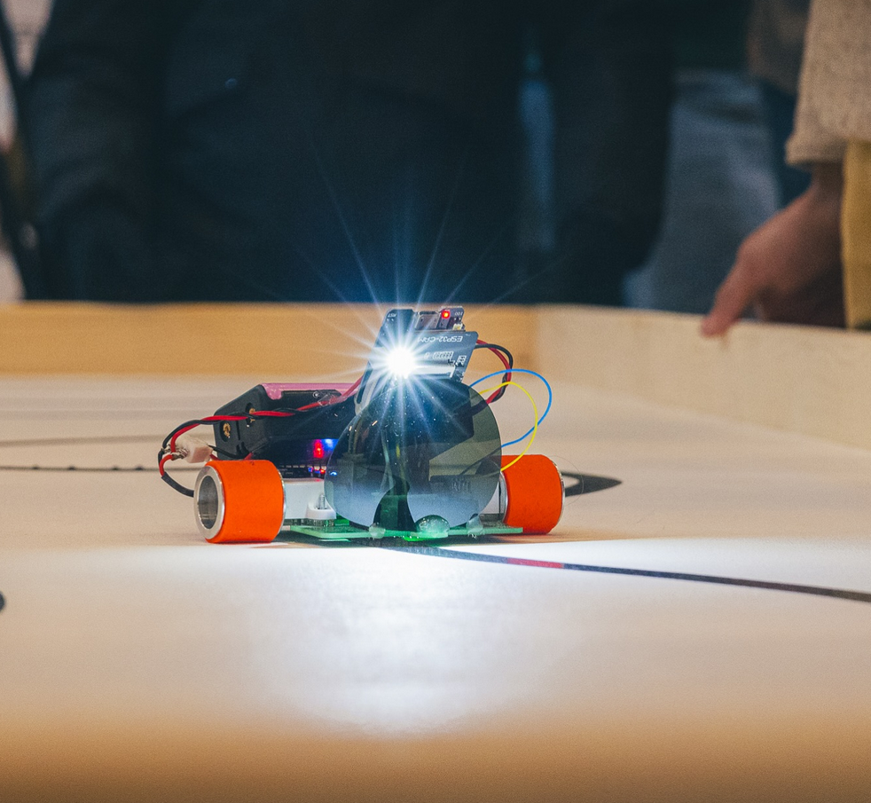

### The rebirth of micromouse_v1 (which was never finished): LineFollower_v1

The micro mouse's platform was retrofitted with an ESP32-CAM module. Why a camera? Because it was, at the time, seen as the quickest solution (and it was, at least from a hardware point of view). In hindsight, it was also a unique solution, as none of the other competitors used a camera for navigation. But since a camera has a lot more pixels than the conventional line sensors, I also had a lot more parameters to play around with and tune.

The robot sadly never finished a timed run during the competition, and the laps that it did complete were way too slow to get even near the top-3. 

The sunglass is used to help against reflections on the tape. The algorithm divides the pixels into black or white batches, and any reflections on the tape would be seen as white pixels, which is bad. 

#### Lessons for next year
- The winner completed a lap in 6 seconds. On a 10 m long track that is 1.6 m/s, which requires 1061 RPM on a 3 cm diameter wheel. This is the minimum theoretical RPM that is needed to get that time. In reality, a much higher RPM is needed as the robot cannot drive at max speed all the time. The conclusion is that my ~250 RPM motors are nowhere near enough.
- The cheap camera that I used now is a cheap knock-off of the real deal. I could only get 12 FPS reliably, and that also limits my control loop to 12 Hz. If I want to drive at more than 1.6 m/s I need a much higher control frequency than that. A higher quality camera could be used (one with a XIAO S3 for example), together with a custom library could allow me to only read parts of the camera buffer at each loop.
- The robot did have some issues with black spots near the line which threw it off-track. I could possibly add two single-pixel line detectors for an inner control loop, and use the camera for an outer planning loop.
- If I want the robot to get really fast, I would need to optimize the curve taking which would require some sort of mapping and planning algorithms.

###### Image courtesy of Tomas Överström/cffc.se
